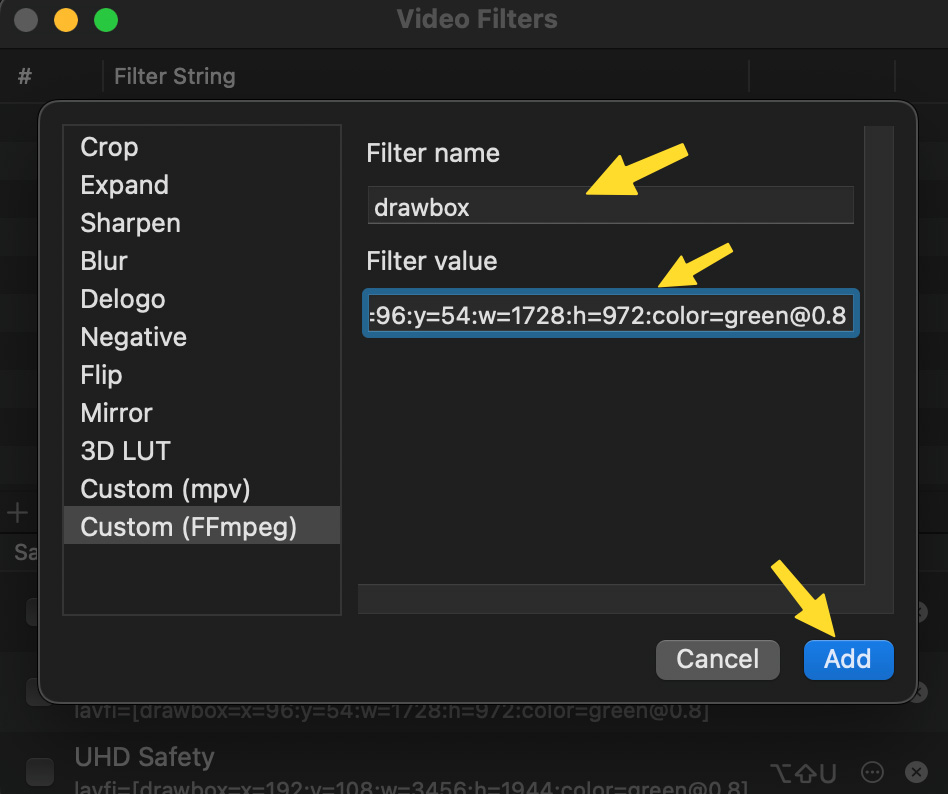

# Union Context Menu
 Custom post-production quick actions for MacOS.

# Description

These installer scripts will install several custom quick actions in MacOS. The installation is streamlined, and user variables are mostly installed automatically via Automator actions.

Dependencies: *FFMPEG, IINA, ExifTool, Adobe After Effects, Adobe Premiere, Rysnc, Progress, and Watch.*

Most of these Quick Actions use a command-line application to monitor progress. They will open a Terminal window and provide updates every 2 seconds for every long action.

# Quick Actions Included

## Find After Effects & Find Premiere
* These two Quick Actions look through a video file's metadata and track back to the software that rendered it. You can use these to find the project that created any video, as long as you render with metadata enabled.
* Usage: right-click on a video. If it finds the source project, it will copy the path to that project to your clipboard. If it knows you can access that project, it will present the option to open the project directly. 

## Transcode to MP4
* This Quick Action allows you to right-click on any video file and transcode it to an MP4 appropriate for an online posting. It also copies any After Effects or Premiere metadata to the MP4, so you can always track back to the original project.

## Copy Path 
* This Quick Action copies the path or any file or folder to the clipboard so you can easily paste it anywhere and share a link to the file or folder.

## Copy LL Path (win)
* Like the Copy Path Quick Action, this iteration converts a Lucid Link MacOS path to a Lucid Link Windows path so you can share links with Windows peers.

## Render After Effects
* This Quick Action will launch *aerender*, the After Effects command-line renderer--allowing you to render After Effects projects in the background. HINT: Renders are faster this way.
* Usage: set up your renders in After Effects and save. Right-Click on the .aep file, and it will render in the Terminal.

## Rsync
* Rsync is a safe way to copy large amounts of data. This Quick Action automates the process and lets you track large data copies. 
* Usage: right-click on a folder and apply. It will ask you to select a destination. While copying, the action will write a timestamped log to your Desktop. 

# Installation

First, click **Code** at the top of this page and then select **Download Zip.** Unzip the package and copy the `Union_Actions` folder to `users/username/Union_Actions`. *username* will be your user in MacOS. This location is important. All the scripts look here for user-variables needed to run the Quick Actions. Inside `Union_Actions` are four installation scripts. Click on these and install them in sequential order. Then follow the instructions to manually configure IINA.

## The Installation Scripts

### 1_InstallHomebrew.app
* This first script installs Homebrew. Homebrew is a package manager that we are using to install other dependencies. Click on the script and follow the instructions. It will ask you to enter your password and press *return*. When finished, it will ask you to run two more commands. **These are important.** Copy and paste each command into the same Terminal window and press return after each paste.

### 2_InstallSoftware.app
* This second script will install all the apps and dependencies. Click return and enter a password when it asks for it. Let it run until the end--it will take a while. It's finished when Terminal returns your username, like the screenshot below.

### 3_InstallSettings.app
* This third script will connect all the Quick Actions to the software on your computer. It's mostly automated except `aerender` and will ask you to manually navigate to, and select, *aerender*. Choose any random file if you don't have After Effects and don't plan on using the rendering Quick Action. HINT: *aerender* is most likely in a location like `/Applications/Adobe After Effects 2023/aerender`.

### 4_InstallScripts.app
* The fourth and final step is to copy all the workflow files from `user/username/Union_Actions/Union_Services' to 'user/username/Library/Services`. The Library is a hidden folder, so this script will open both folders in Finder--allowing you to copy from one to the other easily.

### Set up the Quick Actions.
* To set up the actions, right-click on any file and click `customize`. Toggle the Quick Actions you want.

# Manually Configuring IINA
* In IINA, were are going to set up three custom video filters for the following: ACEScg-to-sRGB color space conversion, HD Safety guides, and UHD safety guides. This configuration will allow us to toggle them on and off whenever needed. To make a new filter, navigate the menu to `Video > Video Filters` and click the plus sign.

### HD Safety Guide
* The first filter we will make is for an HD title/action safety guide. Click the plus sign and add a custom FFMPEG filter, give the filter a title, and add this code to *Filter String*: `[drawbox=x=96:y=54:w=1728:h=972:color=green@0.8]`. Assign a keyboard shortcut to toggle this on/off.

### UHD Safety Gudie
* Next, we will do the same for a UHD safety guide. Use this code for UHD: `[drawbox=x=192:y=108:w=3456:h=1944:color=green@0.8]`.

### ACEScg to sRGB color space conversion
* For this and any other LUT file you want to install, click the plus sign and create a 3D LUT filter. Name your filter, assign a shortcut, and apply the following code in *File Path*: `/Users/username/Union_Actions/luts/ACESsRGB_UnionMPV.cube`. Make sure you change *username* out to your username and apply a path that links to your 3D LUT. NOTE: This will work for any XXXX-to-sRGB/rec709 LUT (in the cube format), so this also works for camera RAW playback too.

# Compatibility

This has only been tested in MacOS Ventura. It should work with older MacOS versions as long as Quick Actions are supported.

# License

You may modify or distribute anything from these scripts as long as it's not for financial gain and you respect the license of any linked dependencies.